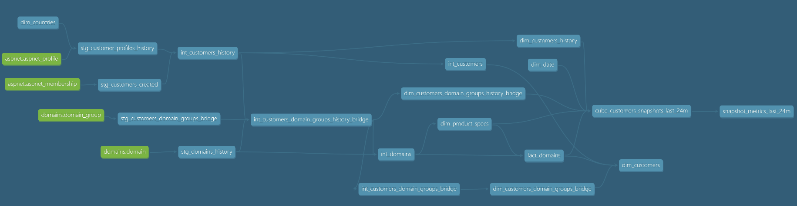

# dbt-usercentrics

This DuckDB dbt project transforms OLTP backend data from Usercentrics into a star schema data model for OLAP analytics. The project is structured into three layers: staging, intermediary, and data mart.

## Project Structure

-   **models/staging**: This layer contains the initial data ingestion from the sources. The data is cleaned and lightly transformed to be used in the downstream models.
-   **models/intermediary**: This layer contains intermediary transformations that are not yet ready for the final data mart. This layer is used to create the dimension and fact tables.
-   **models/data_mart**: This layer contains the final star schema data model, which is composed of dimension and fact tables.

## Data Models

### Logical Data Model
The target is to have a Star Schema data model with a SCD Type 1 customer table to reference the current state of the customers, but as well provide historical information to support historical analysis for the company.


The final data model is a star schema composed of the following tables:

#### Dimensions

-   **dim_date**: Contains a list of dates and their relevant date parts.
-   **dim_countries**: Contains a list of countries with standardized naming convention.
-   **dim_customers**: Contains the current information about customers.
-   **dim_product_specs**: Contains information about product specifications.
-   **dim_customers_history**: Contains the history of customer profile changes.
-   **dim_customers_domain_groups_bridge**: Bridge table between customers and domain groups.
-   **dim_customers_domain_groups_history_bridge**: Historical bridge table between customers and domain groups.

#### Facts

-   **fact_domains**: Contains facts about domains.

#### Cubes

-   **cube_customers_snapshots_last_24m**: Contains relevant information about customers and their usage for the last 24 months.

#### Semantic Layer

-   **snapshot_metrics_last_24m**: Contains relevant metrics pre-calculated for each month in the last 24 months.

### Physical Data Model
To implement the physical data model, we'll use dbt in order to execute the transformations in the data. Before executing the transformations, a exploratory data analysis was executed to valid the datasets.

#### Summary of findings
1. The "PKs" provided are not PKs -> they are not unique in the tables
    - 1.1. These tables look more like SCD2 than source tables
2. aspnet_membership (129,110 unique user_id)
    - 2.1. Some users have multiple "user_create_time". Most of them (+90%) are sequential, having the value matching with the previous "dw_valid_to"
        - 2.1.1. One single user has "dw_valid_to <> '9999-12-31'" -> possible churn
    - 2.2. Few users that don't have these coinciding would need to be assessed upstream with the data producers
    - 2.3. Since for this table we just want the first created date, these problems won't affect our modeling results
    - 2.4. Steady volume, with a spike in 2024 (from ~15k plateau to 52k) due to great volumes in the first months of the year
3. aspnet_profile (129,124 unique user_id)
    - 3.1. The users from aspnet_membership are all in the aspnet_profile, but not the opposite
    - 3.2. The same user that was flagged as possible churn in the aspnet_membership has churned in this table, in the same day
    - 3.3. The NULLs in the column "customer_payment_type" represent a use case for free customers related to the plan "Free Premium"
    - 3.4. There are too many countries, so I'll create a table with the country names instead of handling them in the SQL logic
4. domain (449,381 unique domain_id / 270,380 domain_group_id)
    - 4.1. No observable data quality issues besides missing the PK, every column is complete and there are no noticeable unexpected values
    - 4.2. The column "full_subpage_count" seemed to be a counter at the first sight, but some customers decrease its value over time
        - 4.2.1. Probably this column is the state of the customer implementation of the product over time
    - 4.3. All the temp domains are associated with customers with Free Premium plans
    - 4.4. There are some outliers within the same domain_id, which are concerning, but it would need to confirm if this was possible to happen
        - 4.4.1. domain_id 2257713: the stream was filled with 0s, then the value just after is 3,389, persists for 2 months, and decreases to 30 indefinitely
    - 4.5. Each domain_id belongs to a single domain_group_id
5. domain_group (129,101 unique customer_id / 295,478 domain_group_id)
    - 5.1. There are fewer distinct keys, so probably some customers and/or domains were created, but weren't used yet
    - 5.2. Customers may have multiple domain_group_id and a canceled domain_group_id can be reassigned to another customer

#### Lineage

After the exploratory data analysis, the physical data model was executed by creating the dbt models in this project. The lineage of the project can be checked in the image below



## Running the project

To run this project, you will need to have dbt Core installed and configured with the DuckDB adapter, with a local database containing the data source. You can find more information about how to install dbt Core and the DuckDB adapter in the [dbt documentation](https://docs.getdbt.com/docs/introduction).

Once you have dbt configured, you can run the project using the following command:

```bash
dbt run
dbt docs generate
dbt docs serve
```

This will run all the models in the project and create the final data mart tables in your data warehouse.
